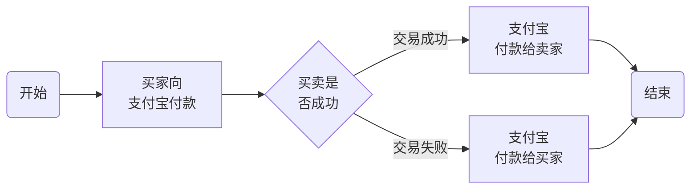
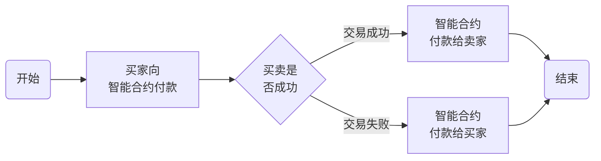

# 以太坊智能合约开发实例

在写其他文章时，想试试智能合约的开发，但发现目前市场上可见的区块链书籍多以概念、理论为主，而网络上所查找的资料又过于零碎。而面向程序员，以开发实践为主的教程却少之又少，所以自己想试着写一个，就是本文。

本文会在[我的博客](https://tson.com/category/blockchain/)、微信公众号（详见下面图片）及[币乎](https://bihu.com/people/122323)中进行同步更新，读者们可以根据自己的喜好选择合适的平台进行阅读。


在开始之前，此文章的作用先说说：

1. 本文是一篇持续更新的文章，在第一版之后的更新内容都会体现在本文中。
2. 本文会在所有文章发布之后，将目录更新到本文中。
3. 本文会将本系列教程中存在的一些名字定义，及面向读者都基本信息进行介绍。

## 目录

暂无

## Change Log

暂无

## 0. 名词定义


**以太坊**

> 以太坊（英文Ethereum）是一个开源的有智能合约功能的公共区块链平台，通过其专用加密货币以太币（Ether）提供去中心化的以太虚拟机（Ethereum Virtual Machine）来处理点对点合约。


**以太(以太币)**

>以太坊中的虚拟货币。


## 1. 面向读者

本书并不会从头讲区块链及编程，所以需要一定的基础。需要读者有如下基础：

1. 对区块链及虚拟货币有基本的了解。
2. 有一定的编程基础。特别是本文中会提到一点网页编写的内容，HTML和JavaScript会在教程中出现，但如果你会使用其他的语言编写过项目也可。
3. 不需要会Solidity。

本书只能算是入门教程，只教给大家写一个非常简单智能合约，所以对已经有智能合约开发经验的人来说，并不是最合适的开发工具书。

## 2. 开发环境搭建


为了方便读者阅读，开发环境搭建这一章节会以Windows、Ubuntu和MacOS三节的形式进行讲解。使用特定系统的读者可以直接跳到相应的章节开始阅读、操作，不会因为跳过某种系统的开发环境搭建产生不连贯感。

### 2.1 Windows开发环境搭建

在搭建开发环境之前，建议使用“适用于 Linux 的 Windows 子系统”或者 VirtualBox 来创建 Ubuntu 系统来进行操作。相比 Windows ，Ubuntu 更适合使用做区块链的开发。不过笔者使用的 Windows 10 专业版，命令也以 Windows 平台上为主，在教程中如果出现不同平台命令不同的情况，我会予以说明。

#### 安装 nodejs

nodejs也有专门的 Windows 安装包，可以到 nodejs 的官方网站 https://nodejs.org/zh-cn/ 上下载。笔者写作时 Windows (x64) 的长期支持版为 10.15.1，笔者使用的就是这个版本。一般情况下，nodejs的版本不同，不会影响后续安装和使用。直接下载程序，安装，一路下一步即可。

安装完成后可以打开命令行工具（CMD或PowerShell）输入```node -v```和```npm -v```查看版本号，笔者的nodejs版本为10.15.1，npm的版本为6.4.1。

#### 安装 Ganache

Ganache是以太坊节点仿真器，可以方便开发者快速进行以太坊DApp的开发与测试。安装Ganache之后，会在你的电脑上运行一个以太坊的私链，自动创建10个账号，每个账号中有100.00 ETH。

Ganache有专门针对 Windows 系统的图形化的应用程序，可以在官方网站 https://truffleframework.com/ganache 中下载到。由于常年使用 Windows 所以比较习惯图形化的界面，所以本文后面都以图形化的界面使用 Ganache。

打开 Ganache 官方网站，下载 Windows 安装包，基本一路下一步就可以完成安装，安装后运行界面如下：


#### 安装 Truffle

> Truffle是针对基于以太坊的Solidity语言的一套开发框架。


这么说可能大家没有什么直观印象，给大家介绍一下Truffle的功能，大家一下子就明白了。以我的理解（本文中主要使用的功能）：

> - Truffle将Solidity编程中很多细节都封装起来，让用户可以专注于智能合约的开发，而不用关注其他细节。
> - Truffle将很多通用的实例封装起来，利于用户引用，修改。


关于Truffle更多的细节可以参考《[Truffle - 以太坊Solidity编程语言开发框架](http://truffle.tryblockchain.org/index.html)》，本文不作详细介绍。

安装Truffle需要通过命令行工具（CMD 或 PowerShell），在命令行工具中运行以下命令：

```shell
npm install -g truffle
```

安装完成后可以通过```truffle version```来查看版本号。笔者安装完成后truffle的版本为：

> Truffle v5.0.7 (core: 5.0.7)
> Solidity v0.5.0 (solc-js)
> Node v8.10.0


是的，你没有看错，Solidity也一起安装了，这是由于Truffle基于Solidity。

这样，Windows系统的开发环境就搭建好了。当然，也有读者想知道我用的什么编辑器编辑代码。实际上，你即使使用记事本，也是可以编辑代码的。但我选用的是 Visual Studio Coder，安装了 ESLint 和 solidity 插件。大家也可以选用自己喜欢的编辑器。

### 2.2 Ubuntu 开发环境搭建

本文以Ubuntu 18.04 LTS为基础环境。在开始前，先运行```sudo apt update```更新系统组件。系统基本没有安装任何新软件，系统自己带的Python的版本为Python 2.7.15rc1 (default, Nov 12 2018, 14:31:15)。

#### 安装nodejs

nodejs是后续安装的基础之一，必须安装。可以通过以下命令安装nodejs和npm：

```shell
sudo apt install nodejs npm
```

由于国内网络问题，此步骤可能需要一点时间。

安装之后可以通过```node -v```和```npm -v```来查看nodejs和npm的版本，笔者安装之后nodejs版本为8.10.0，npm版本为3.5.2。

#### 安装Ganache

Ganache是以太坊节点仿真器，可以方便开发者快速进行以太坊DApp的开发与测试。安装Ganache之后，会在你的电脑上运行一个以太坊的私链，自动创建10个账号，每个账号中有100.00 ETH。

在 Ubuntu 系统中，也有还图形化的界面的 Ganache，可以在其实官方网站 https://truffleframework.com/ganache 中下载安装。安装过程和一般的程序安装没有任何区别，界面和 Windows 也是一样的。

在Ubuntu中，你可能也想尝试一下命令行。可以通过以下命令安装Ganache：

```shell
sudo npm install -g ganache-cli
```

注：

1. ganache-cli是Ganache的一个命令行工具，在Ubuntu中使用特别方便。
2. 安装Ganache后，在后面的开发时，所有的智能合约都不会在以太坊上实际部署。具体如何部署，会在后文**第6章项目发布**中具体阐述。

通过命令```ganache-cli```命令就可以查看安装好的Ganache CLI的具体信息，笔者安装的版本为Ganache CLI v6.4.1 (ganache-core: 2.5.3)。

#### 安装Truffle

> Truffle是针对基于以太坊的Solidity语言的一套开发框架。


这么说可能大家没有什么直观印象，给大家介绍一下Truffle的功能，大家一下子就明白了。以我的理解（本文中主要使用的功能）：

> - Truffle将Solidity编程中很多细节都封装起来，让用户可以专注于智能合约的开发，而不用关注其他细节。
> - Truffle将很多通用的实例封装起来，利于用户引用，修改。


关于Truffle更多的细节可以参考《[Truffle - 以太坊Solidity编程语言开发框架](http://truffle.tryblockchain.org/index.html)》，本文不作详细介绍。

安装Truffle可以通过以下命令：

```shell
sudo npm install -g truffle
```

安装完成后可以通过```truffle version```来查看版本号。笔者安装完成后truffle的版本为：

> Truffle v5.0.7 (core: 5.0.7)
> Solidity v0.5.0 (solc-js)
> Node v8.10.0


是的，你没有看错，Solidity也一起安装了，这是由于Truffle基于Solidity。

### 2.3 MacOS开发环境搭建

笔者使用的是最新版的MacOS系统（macOS Mojave 10.14.1），在开始之前，基本没有安装任何的与以太坊相关的软件。由于macOS和 Ubuntu 比较像，所以大家可以看到，下面的安装与上一节在 Ubuntu 中开发环境的搭建比较像。

#### 安装 nodejs

nodejs也有专门的 macOS 安装包，可以到 nodejs 的官方网站 https://nodejs.org/zh-cn/ 上下载。笔者写作时 macOS (x64) 的长期支持版为 10.15.3，笔者使用的就是这个版本。一般情况下，nodejs的版本不同，不会影响后续安装和使用。直接下载程序，安装，一路下一步即可。

安装完成后可以打开命令行工具（CMD或PowerShell）输入```node -v```和```npm -v```查看版本号，笔者的nodejs版本为10.15.3，npm的版本为6.4.1。

#### 安装 Ganache

Ganache是以太坊节点仿真器，可以方便开发者快速进行以太坊DApp的开发与测试。安装Ganache之后，会在你的电脑上运行一个以太坊的私链，自动创建10个账号，每个账号中有100.00 ETH。

Ganache有专门针对 macOS 系统的图形化的应用程序，可以在官方网站 https://truffleframework.com/ganache 中下载到。由于常年使用 Windows 所以比较习惯图形化的界面，所以本文后面都以图形化的界面使用 Ganache。如果你常年使用 macOS 应该也会对图形界面比较熟悉，那么后面的教程对你来说也会比较顺手。

打开 Ganache 官方网站，下载 macOS 安装包，基本一路下一步就可以完成安装，安装后运行界面如下：


#### 安装 Truffle

> Truffle是针对基于以太坊的Solidity语言的一套开发框架。


这么说可能大家没有什么直观印象，给大家介绍一下Truffle的功能，大家一下子就明白了。以我的理解（本文中主要使用的功能）：

> - Truffle将Solidity编程中很多细节都封装起来，让用户可以专注于智能合约的开发，而不用关注其他细节。
> - Truffle将很多通用的实例封装起来，利于用户引用，修改。


关于Truffle更多的细节可以参考《[Truffle - 以太坊Solidity编程语言开发框架](http://truffle.tryblockchain.org/index.html)》，本文不作详细介绍。

安装Truffle需要通过命令行工具（CMD 或 PowerShell），在命令行工具中运行以下命令：

```shell
npm install -g truffle
```

安装完成后可以通过```truffle version```来查看版本号。笔者安装完成后truffle的版本为：

> Truffle v5.0.7 (core: 5.0.7)
> Solidity v0.5.0 (solc-js)
> Node v8.10.0


是的，你没有看错，Solidity也一起安装了，这是由于Truffle基于Solidity。

这样，Windows系统的开发环境就搭建好了。当然，也有读者想知道我用的什么编辑器编辑代码。实际上，你即使使用记事本，也是可以编辑代码的。但我选用的是 Visual Studio Coder，安装了 ESLint 和 solidity 插件。大家也可以选用自己喜欢的编辑器。

### 2.4 常见问题

#### 使用“适用于 Linux 的 Windows 子系统”相对于 VirtualBox/VMware 有什么优势？

> 相对于 VirtualBox/VMware 来说，“适用于 Linux 的 Windows 子系统”占用硬盘空间少、占用系统内存少、速度快等特点。但稳定性、完整性差。
>
> 由于很多组件在 Windows 安装并不方便，所以本书在写作过程中实际上使用的主要是在 Windows 系统下安装了 VMware ，然后在 VMware 上安装了 Ubuntu 系统进行开发的。
>
> 所以，“适用于 Linux 的 Windows 子系统”一般用于开发环境。实际生产环境请使用 VirtualBox/VMware 或者直接在电脑上安装 Ubuntu。


#### 初学者应该从 Truffle 入门还是从头学起？

> 从前方的开发环境配置大家就能看出我是支付从 Truffle 开始的。
>
> 因为我认为一开始掌握大量的细节会使学习成本大大增加。我更倾向于抛开细节，先把代码跑起来。然后从项目中一点一点的了解各种细节。这样非有利于开发者快速入门。
>
> 但从 Truffle 开始也有很大弊端，那就是开发者有可能基础不牢，可能开发一段时间后需要从新开始学习Solidity的基础。


#### 使用apt及npm安装组件时，国内下载速度非常慢怎么办？

> 这是一个国内开发者经常遇到的问题，国内已经有很不错的解决方案：对于教育网用户，建议大家使用清华大学的源替换原有的源，请参照[Ubuntu | 镜像站使用帮助 | 清华大学开源软件镜像站 | Tsinghua Open Source Mirror](https://mirrors.tuna.tsinghua.edu.cn/help/ubuntu/)，其他用户建议使用阿里云的源，请参照[阿里巴巴开源镜像站](https://opsx.alibaba.com/mirror)（点击 Ubuntu 后面的帮助按钮获取帮助）


#### 在进行开发时使用哪种代码编辑器？

前面已经说过了，其实使用哪一种编辑器并不重要，但如果有代码高亮显示及代码提示肯定会提高我们和编程效率。所以我选用了自己用着比较顺手的 Visual Studio Coder，大家可以根据自己的喜好选择 IDE 。

## 3. 智能合约概览：发布自己的虚拟货币

发行一种自己的虚拟货币是以太坊中最常见的功能之一。如果只实现简单的功能（不考虑安全性，不考虑应用），发行自己的虚拟货币也是非常简单的一件事。本章就实现一种最简单的虚拟货币，我们把这种叫做教程币（JCB）。

### 3.1 发布自己的虚拟货币

用了Truffle你会发现，发布自己的虚拟货币太容易。就几行命令的事。

#### 3.1.1 创建教程币（JCB）

在命令行中输入：

```shell
mkdir JCB
cd JCB
truffle unbox metacoin
```

如果成功安装，则最后一个命令返回：

```shell
✔ Preparing to download
✔ Downloading
✔ Cleaning up temporary files
✔ Setting up box

Unbox successful. Sweet!

Commands:

  Compile contracts: truffle compile
  Migrate contracts: truffle migrate
  Test contracts:    truffle test
```

这里把最后一行命令```truffle unbox metacoin```解释一下：

在Truffle中，包（Box）是一个非常重要的概念。Truffle将一些常用的项目，打成一个包，在需要使用的时候使用```unbox```命令将包内的项目释放到指定的目录中。

所以，```truffle unbox metacoin```表示将```metacoin```这个包的内容释放到当前目录。```metacoin```包是Truffle官方提供了一个简单的虚拟货币的示例。

我们这里叫我们的虚拟货币叫JCB，实际上你叫什么名字都可以！！！因为这个简单的示例所搞的虚拟货币没有名字。大写的尴尬。

现在我们就有一个简单的自己创建的虚拟货币啦！

#### 3.1.2 发布JCB到私链

你当然可以把我们上面创建的虚拟货币发布到以太坊公链上去。但这个操作其实没有任何意义，只浪费了以太坊的资源。而且还奇慢无比，而且还浪费钱（以太坊）。所以，在进行编程、调试及测试时一般都把智能合约发布到一个和以太坊公链相似的私链上，这样就能又快又省钱的进行程序开发。

如前文所述，我们使用Ganache来创建私链。在 Windows 中，我们可以直接打开 Ganache 程序，以显示GUI。在 Ubuntu 或 MacOS中，可以使用```ganache-cli```命令来启用命令行工具。


默认情况下，Ganache会自动创建10个用户，每个用户会有100个以太坊以方便进行程序的部署和调试。默认的 PRC SERVER 为 http://127.0.0.1:7545。

为了将我们的虚拟货币发布到Ganache私链上，我们还需要对 JCB 文件夹中的代码进行修改。打开 JCB/truffle-config.js，将内容修改为（一般情况下只要取消注释就可以）：

```javascript
module.exports = {
  // Uncommenting the defaults below 
  // provides for an easier quick-start with Ganache.
  // You can also follow this format for other networks;
  // see <http://truffleframework.com/docs/advanced/configuration>
  // for more details on how to specify configuration options!

  networks: {
    development: {
      host: "127.0.0.1",
      port: 7545,
      network_id: "*"
    },
    test: {
      host: "127.0.0.1",
      port: 7545,
      network_id: "*"
    }
  }
};
```

打开命令行工具，进行 JCB 文件夹后依次执行：

```shell
truffle compile
truffle migrate
```
正常返回类似结果：
```shell 
Compiling your contracts...
===========================
> Compiling .\contracts\ConvertLib.sol
> Artifacts written to C:\code\JCB\build\contracts
> Compiled successfully using:
   - solc: 0.5.0+commit.1d4f565a.Emscripten.clang
```

然后执行：

```shell
truffle test
```

返回类似如下结果：

```shell
Compiling your contracts...
===========================
> Compiling .\contracts\ConvertLib.sol
> Compiling .\test\TestMetacoin.sol
> Artifacts written to C:\Users\RileyGe\AppData\Local\Temp\test-119212-19848-1wwqoo5.6l95
> Compiled successfully using:
   - solc: 0.5.0+commit.1d4f565a.Emscripten.clang


  TestMetacoin
    √ testInitialBalanceUsingDeployedContract (86ms)
    √ testInitialBalanceWithNewMetaCoin (59ms)

  Contract: MetaCoin
    √ should put 10000 MetaCoin in the first account (40ms)
    √ should call a function that depends on a linked library (56ms)
    √ should send coin correctly (193ms)


  5 passing (7s)
```

注：在执行```truffle test```时默认会重新执行```truffle compile```和```truffle migrate```命令，所以在实际使用时经常会直接执行```truffle test```。但为了显示工作流程，本文仍旧将三个命令依次执行。

执行完```truffle test```之后你会发现第一个用户的余额发生了变化，私链的区块数也发生了变化。如下图所示：


然后转到 **TRANSACTIONS** 标签中会发现已经有好几个事件：


说明我们的虚拟货币 JCB 已经布置到Ganache链上。

#### 3.1.3 将JCB发送给其他用户

由于我们发布的 JCB 是一种特别简单的虚拟货币，并不满足一些常见的如 ERC20 标准，所以只能通过自己编写代码来进行虚拟货币的发送与接收。这里就不得不引入一个 JavaScript 库：web3.js。

web3.js 是最常用的与以太坊进行交互的方式之一，它可以通过网页就可以进行简单的操作。为此我编写了一个简单的网页：

```html
<!DOCTYPE html>
<html>
<head>
    <meta charset="UTF-8">
    <script src="https://cdn.jsdelivr.net/gh/ethereum/web3.js/dist/web3.min.js"></script>
    <script type="text/javascript">
	var metacoin_token_abi = [
		{
		  "inputs": [],
		  "payable": false,
		  "stateMutability": "nonpayable",
		  "type": "constructor"
		},
		{
		  "anonymous": false,
		  "inputs": [
			{
			  "indexed": true,
			  "name": "_from",
			  "type": "address"
			},
			{
			  "indexed": true,
			  "name": "_to",
			  "type": "address"
			},
			{
			  "indexed": false,
			  "name": "_value",
			  "type": "uint256"
			}
		  ],
		  "name": "Transfer",
		  "type": "event"
		},
		{
		  "constant": false,
		  "inputs": [
			{
			  "name": "receiver",
			  "type": "address"
			},
			{
			  "name": "amount",
			  "type": "uint256"
			}
		  ],
		  "name": "sendCoin",
		  "outputs": [
			{
			  "name": "sufficient",
			  "type": "bool"
			}
		  ],
		  "payable": false,
		  "stateMutability": "nonpayable",
		  "type": "function"
		},
		{
		  "constant": true,
		  "inputs": [
			{
			  "name": "addr",
			  "type": "address"
			}
		  ],
		  "name": "getBalanceInEth",
		  "outputs": [
			{
			  "name": "",
			  "type": "uint256"
			}
		  ],
		  "payable": false,
		  "stateMutability": "view",
		  "type": "function"
		},
		{
		  "constant": true,
		  "inputs": [
			{
			  "name": "addr",
			  "type": "address"
			}
		  ],
		  "name": "getBalance",
		  "outputs": [
			{
			  "name": "",
			  "type": "uint256"
			}
		  ],
		  "payable": false,
		  "stateMutability": "view",
		  "type": "function"
		}
	];
	
	window.addEventListener('load', function () {
		if (typeof web3 !== 'undefined') {
			console.log('Web3 Detected! ' + web3.currentProvider.constructor.name)
			window.web3 = new Web3(web3.currentProvider);
		} else {
			console.log('No Web3 Detected... using HTTP Provider')
			window.web3 = new Web3(new Web3.providers.HttpProvider("http://localhost:7545"));
		}
	})

	async function getBalance() {
		var contractAddress, contractABI, tokenContract, balance, balance2
		contractAddress = document.getElementById("contractAddress").value

		contractABI = metacoin_token_abi
		tokenContract = web3.eth.contract(contractABI).at(contractAddress)

		balance = await tokenContract.getBalance.call(web3.eth.accounts[0])
		balance2 = await tokenContract.getBalance.call(web3.eth.accounts[1])

		document.getElementById("output2").innerHTML = "地址1: " + balance + "JCB。地址2: " + balance2 + " JCB"
	}

	async function transfer() {
		var contractAddress, contractABI, tokenContract, balance, balance2, amount
		amount = document.getElementById("amount").value
		contractAddress = document.getElementById("contractAddress").value

		contractABI = metacoin_token_abi
		tokenContract = web3.eth.contract(contractABI).at(contractAddress)

		await tokenContract.sendCoin.sendTransaction(web3.eth.accounts[1], amount, {from: web3.eth.accounts[0]})
	}  
	</script>
</head>
<body>
    <h1>自定义代币交互</h1>
	<p>合约地址:</p>
    <input type="text" size="50" id="contractAddress" value="0x787A98746a5bB75A2783f7d8378aCB48B09eB169"/>    
    <br />
	<p>地址1向地址2转账数量:</p>
    <input type="text" size="50" id="amount" value="100"/>
	<button type="button" onClick="transfer();">转帐</button>
    <br />
	<br />
	<button type="button" onClick="getBalance();">获取MetaCoin数量</button>
    <br />
    <br />
    <div id="output2"></div>
</body>
</html>
```

上面的页面中实际起作用的只有不到20行，实现了两个基本的功能：查询余额、转账。显示效果如下：


具体如何使用web3.js会在下一节代码分析中作更详细的说明。

### 3.2 代码分析

前面我们没有改一行代码就完成了虚拟货币 JCB 的发布，只用有限的几行 JavaScript 语句就实现了 JCB 账号余额查询及转账功能。这并不是说我们不需要写代码，而是Truffle已经帮我们把代码写好了，这一节我就和读者们一起分析一下Truffle给我们生成的代码。

#### 3.2.1 目录结构及作用

Truffle生成的目录结构如下：

```shell
JCB
│  LICENSE
│  truffle-config.js
│
├─contracts
│      ConvertLib.sol
│      MetaCoin.sol
│      Migrations.sol
│
├─migrations
│      1_initial_migration.js
│      2_deploy_contracts.js
│
└─test
        metacoin.js
        TestMetacoin.sol
```

如果大家现在看自己的文件夹目录结构可能和这个有所不同，多了一个`build`文件夹。`build`文件夹是由`truffle compile`产生的文件，这里暂时不用讲解。各个目录作用如下：

- `contracts/`:  Solidity智能合约代码，其中Migrations.sol是Truffle必须的，其他可以删除或修改。
- `migrations/`:  合约部署脚本，其中1_initial_migration.js就是用来部署Migrations.sol的，其他的脚本会按照顺序依次执行。
- `test/`:  测试代码。
- `truffle-config.js`:  Truffle 配置文件。

#### 3.2.2 MetaCoin合约和Solidity基础

`contracts`文件夹是整个项目的基础。而这个文件夹中的`MetaCoin.sol`又是这个基础中最重要的一个文件。现在我们就来一行一行的研究一下这个文件。

首先，我给文件增加了一点中文注释：

```javascript
pragma solidity >=0.4.25 <0.6.0; //solidity版本，表示兼容0.4.25至0.6.0（不包含）之间的版本

import "./ConvertLib.sol";

// 这只是一个示例，类虚拟货币的合约，它并不是一种标准虚拟货币，不能与其他货币兑换
// 如果你想创建一种标准虚拟货币，请参照：https://github.com/ConsenSys/Tokens

contract MetaCoin { //声明为合约
	mapping (address => uint) balances;

	event Transfer(address indexed _from, address indexed _to, uint256 _value);

	constructor() public { //构造函数
		balances[tx.origin] = 10000;
	}

	function sendCoin(address receiver, uint amount) public returns(bool sufficient) {
		if (balances[msg.sender] < amount) return false;
		balances[msg.sender] -= amount;
		balances[receiver] += amount;
		emit Transfer(msg.sender, receiver, amount);
		return true;
	}

	function getBalanceInEth(address addr) public view returns(uint){
		return ConvertLib.convert(getBalance(addr),2);
	}

	function getBalance(address addr) public view returns(uint) {
		return balances[addr];
	}
}
```

大家可以看到，Solidity和普通的面向对象的语言非常像。

##### 第8行：声明合约

Solidity用关键字`contract`声明了一个合约（类似于C#中的类）。在 Truffle 中需要注意的是，**合约名需要和文件名相一致**。

在Solidity中，常见的除了合约之外还有`library`（库）。库有点类似于C#中的表态类，其中一般包含了若干个函数，可以在其他库中或合约中引用。在代码的第3行代码用`import`关键字包含了一个库。大家有兴趣可以打开`ConvertLib.sol`查看一下，在此文件中确实用`library`关键字声明了一个库。

##### 第9行：映射类型变量

在这一行里面出现了两种新的类型：`mapping`和`address`。先说比较简单的`address`。`address`就是**地址**，保存一个以太坊的地址，如`0xdCad3a6d3569DF655070DEd06cb7A1b2Ccd1D3AF`。`mapping`叫做**映射**，可以理解为字典类型，里面存储了很多Key和Value的对。但这个字典类型又有点不同：一是他在初始化时所有可能的Key都被虚拟化的创建，也就是说所有可能的Key都对应Value的默认值。二是映射没有长度，键集合（或列表），值集合（或列表）这样的概念。

明白这两个类型之后第9行的意思就非常明白了：创建了一个Key类型为`address`，值类型为`unit`的映射，并把这个映射命名为` balances`。

前面既然说到了类型，那么就简略的介绍一下Solidity中的类型。除了`mapping`和`address`这些比较特殊的类型外，Solidity和普通的面向对象的语言一样，也有布尔类型（bool:true,false）、整型（int/uint）、字符串、数组、枚举等。后面如果遇到相应可能会引起误会的地方，我再详细说明。

##### 第11行：定义事件

此行定义了一个事件（`event`），这种类型可以方便DApp来进行监听。在这里定义了一个转账事件，如果监听了这个事件后，如果系统里面有转账操作，监听者就可以得到通知。在得到通知的时候，还会收到三个参数 `_from`（转账发起人）、`_to`（转账接受人）和`_value`（转账金额）。

除了这些之外，大家可能也注意到在类型`address`和变量名`_from`之间还有一个关键字`indexed`。这个`indexed`是个修改器（Modifier），**修改器可以给对相应的函数或者变量进行扩展或限制。**`indexed`用于修饰事件的参数时，可以在监听事件时对该参数的值进行过滤过滤。例如上面的代码我可以监听`_from`为`0xc38DeFF057F647016616d251146F7AAb21A06BF1`的转账事件。但`indexed`也有一定的局限性，那就是一个事件中最多可以对三个参数增加这样的修改器。

##### 第13-15行：构造函数

`contract`和类一样，都是有构造函数的。第13-15行就是一个构造函数，只会在合约第一次发布到区块链上的时候执行一次。相比类的构造函数，智能合约的构造函数有如下不同：

- 只可以有0个或1个构造函数，不可有多个构造函数
- 构造函数只能为`public`
- 在Solidity 0.4.22（不包含）之前是通过`function contraceName()`的方式来定义构造函数；Solidity 0.4.22（包含）之后是通过`constructor()`的方式来定义构造函数。

智能合约的构造函数和类的构造函数功能也是类似的。智能合约的构造函数的作用是在合约对象创建时，调用构造函数对相关数据进行初始化处理。

在构造函数名字后面有一个`public`关键字，表示构造函数的可见性。函数和变量有四种可见性类型：`external`、`public` 、`internal` 或 `private`。默认情况下**函数**可见性为 `public`，**变量**可见性为 `external`。

对于`public`、`internal`和`private`都比较好理解：

- `public`表示可外部访问
- `private`表示仅可内部访问
- `internal`表示可内部访问，也可派生合约访问

`external`的概念需要好好理解一下。**`external`只可以修饰函数，不可以修饰变量。**`external`函数是一个类似于C#中静态函数的概念，在调用和运行方式都与`public`有很大不同。需要注意的是，当处理大量数据的时候，外部函数一般会更有效率、更节能费用（gas）。具体原理和使用方法这里不细说，当使用到的时候再讲。

相对于构造函数，智能合约也**析构函数**。析构函数一般在其他函数中显示调用，用于销毁自身占用资源。典型的析构函数如下：

```javascript
function kill() {
    if (msg.sender == owner) selfdestruct(owner);
}
```

在构造函数中实际起作用的只有一行`balances[tx.origin] = 10000`。`balances`是我们之前就定义好的映射变量，此句的含义就是给`tx.origin`这个地址充了`10000`个虚拟货币（本文中的JCB）。那么这个`tx.origin`又是什么东西呢？

`tx.origin`是一个**特殊变量**。在全局命名空间中预设了一些特殊的变量和函数，他们主要用来提供关于区块链的信息或一些通用的工具函数，这些变量和工具函数被称作**特殊变量和函数**。常见的特殊变量和函数如下：

- `block.blockhash(uint blockNumber) returns (bytes32)`：指定区块的区块哈希——仅可用于最新的 256 个区块且不包括当前区块；而 blocks 从 0.4.22 版本开始已经不推荐使用，由 `blockhash(uint blockNumber)` 代替
- `block.coinbase` (`address`): 挖出当前区块的矿工地址
- `block.difficulty` (`uint`): 当前区块难度
- `block.gaslimit` (`uint`): 当前区块 gas 限额
- `block.number` (`uint`): 当前区块号
- `block.timestamp` (`uint`): 自 unix epoch 起始当前区块以秒计的时间戳
- `gasleft() returns (uint256)`：剩余的 gas
- `msg.data` (`bytes`): 完整的 calldata
- `msg.gas` (`uint`): 剩余 gas - 自 0.4.21 版本开始已经不推荐使用，由 `gesleft()` 代替
- `msg.sender` (`address`): 消息发送者（当前调用）
- `msg.sig` (`bytes4`): calldata 的前 4 字节（也就是函数标识符）
- `msg.value` (`uint`): 随消息发送的 wei 的数量
- `now` (`uint`): 目前区块时间戳（`block.timestamp`）
- `tx.gasprice` (`uint`): 交易的 gas 价格
- `tx.origin` (`address`): 交易发起者（完全的调用链）

##### 第17-23行：sendCoin函数

这7行定义了一个完整的函数，函数的可见性为`public`，返回类型为`bool`，有两个参数。与其他面向对象的语言不同的地方可能只有这些关键字的排列顺序了。

在第21行时，显式触发了第11行定义的事件，使用了`

##### 第25-31行：其他两个函数

这几行定义了两个函数，和前面没有太大不同。主要有两点需要注意：

- 在函数中加入了一个`view`关键字。和前方提到的`indexed`一样，是一个修改器。此修改器修饰函数时，等同于`constant`。表示此函数只能进行读取，不能修改状态。
- 调用了`ConvertLib`库中的`convert`函数。

虽然这里只介绍了一个合约，但实际上Solidity和其他面向对象的语言差别基本都已经出来了，后面就开始正式使用Solidity开始编写智能合约了。

#### 3.2.3 使用web3.js与智能合约进行交互

本节默认的认为读者有一定的HTML和JavaScript基础（哈哈，没有用CSS，所以界面很丑，大家请忍耐），所以不会对HTML和JavaScript语言的一些细节进行讲解。

当然，也可能有读者并不使用JavaScript，web3也有其他语言的库：

- Python [Web3.py](https://github.com/pipermerriam/web3.py)
- Haskell [hs-web3](https://github.com/airalab/hs-web3)
- Java [web3j](https://github.com/web3j/web3j)
- Scala [web3j-scala](https://github.com/mslinn/web3j-scala)
- Purescript [purescript-web3](https://github.com/f-o-a-m/purescript-web3)
- PHP [web3.php](https://github.com/sc0Vu/web3.php)

使用其他的语言库也可以与区块链进行交互，但本书并不进行讨论，大家可以自行研究。

##### web3.js介绍

笔者认为很多人都过于复杂的介绍了web3.js。其实对于使用者来说，web3.js如何与区块链通信使用者并不关心，我只关心如何使用就可以了。所以介绍web3.js时，我们只要知道它是一个与区块链交互的工具就可以了。

web3.js可以直接在网页中使用，而不需要安装。可以直接通过CDN来引入`web3.min.js`：

```html
<script src="https://cdn.jsdelivr.net/gh/ethereum/web3.js/dist/web3.min.js"></script>
```

在实际使用时不推荐使用CDN来引入`web3.min.js`。因为如果CDN自身出了问题，会导致`web3.min.js`中包含攻击代码，而使自己的DApp面临很大风险。但本书只作教程，不实际操作资金，所以为了方便直接从CDN引入。

读者也可以从github下载`web3.min.js`。请从web3.js的master分支来下载web3.min.js，下载地址为：[ethereum/web3.js at master](https://github.com/ethereum/web3.js/tree/master)，然后在网页中使用。

把之前的代码再贴过来，然后我们一行一行的进行分析：

```html
<!DOCTYPE html>
<html>
<head>
    <meta charset="UTF-8">
    <script src="https://cdn.jsdelivr.net/gh/ethereum/web3.js/dist/web3.min.js"></script>
    <script type="text/javascript">
	var metacoin_token_abi = [
		{
		  "inputs": [],
		  "payable": false,
		  "stateMutability": "nonpayable",
		  "type": "constructor"
		},
		{
		  "anonymous": false,
		  "inputs": [
			{
			  "indexed": true,
			  "name": "_from",
			  "type": "address"
			},
			{
			  "indexed": true,
			  "name": "_to",
			  "type": "address"
			},
			{
			  "indexed": false,
			  "name": "_value",
			  "type": "uint256"
			}
		  ],
		  "name": "Transfer",
		  "type": "event"
		},
		{
		  "constant": false,
		  "inputs": [
			{
			  "name": "receiver",
			  "type": "address"
			},
			{
			  "name": "amount",
			  "type": "uint256"
			}
		  ],
		  "name": "sendCoin",
		  "outputs": [
			{
			  "name": "sufficient",
			  "type": "bool"
			}
		  ],
		  "payable": false,
		  "stateMutability": "nonpayable",
		  "type": "function"
		},
		{
		  "constant": true,
		  "inputs": [
			{
			  "name": "addr",
			  "type": "address"
			}
		  ],
		  "name": "getBalanceInEth",
		  "outputs": [
			{
			  "name": "",
			  "type": "uint256"
			}
		  ],
		  "payable": false,
		  "stateMutability": "view",
		  "type": "function"
		},
		{
		  "constant": true,
		  "inputs": [
			{
			  "name": "addr",
			  "type": "address"
			}
		  ],
		  "name": "getBalance",
		  "outputs": [
			{
			  "name": "",
			  "type": "uint256"
			}
		  ],
		  "payable": false,
		  "stateMutability": "view",
		  "type": "function"
		}
	];
	
	window.addEventListener('load', function () {
		if (typeof web3 !== 'undefined') {
			console.log('Web3 Detected! ' + web3.currentProvider.constructor.name)
			window.web3 = new Web3(web3.currentProvider);
		} else {
			console.log('No Web3 Detected... using HTTP Provider')
			window.web3 = new Web3(new Web3.providers.HttpProvider("http://localhost:7545"));
		}
	})

	async function getBalance() {
		var contractAddress, contractABI, tokenContract, balance, balance2
		contractAddress = document.getElementById("contractAddress").value

		contractABI = metacoin_token_abi
		tokenContract = web3.eth.contract(contractABI).at(contractAddress)

		balance = await tokenContract.getBalance.call(web3.eth.accounts[0])
		balance2 = await tokenContract.getBalance.call(web3.eth.accounts[1])

		document.getElementById("output2").innerHTML = "地址1: " + balance + "JCB。地址2: " + balance2 + " JCB"
	}

	async function transfer() {
		var contractAddress, contractABI, tokenContract, balance, balance2, amount
		amount = document.getElementById("amount").value
		contractAddress = document.getElementById("contractAddress").value

		contractABI = metacoin_token_abi
		tokenContract = web3.eth.contract(contractABI).at(contractAddress)

		await tokenContract.sendCoin.sendTransaction(web3.eth.accounts[1], amount, {from: web3.eth.accounts[0]})
	}  
	</script>
</head>
<body>
    <h1>自定义代币交互</h1>
	<p>合约地址:</p>
    <input type="text" size="50" id="contractAddress" value="0x787A98746a5bB75A2783f7d8378aCB48B09eB169"/>    
    <br />
	<p>地址1向地址2转账数量:</p>
    <input type="text" size="50" id="amount" value="100"/>
	<button type="button" onClick="transfer();">转帐</button>
    <br />
	<br />
	<button type="button" onClick="getBalance();">获取MetaCoin数量</button>
    <br />
    <br />
    <div id="output2"></div>
</body>
</html>
```

##### 第100-106行：web3的初始化

此部分是在页面的`load`事件中，初始化`web3`这个变量。第110-112行主要是为兼容一些常见的插件。如 MetaMask 这类的插件会在页面中创建一个`web3`变量。如果安装了这些插件，`web3`直接用原`web3`对象进行初始化，如果没有，则直接用本地的RPC SERVER（前文有介绍，Ganache的默认RPC SERVER为  http://127.0.0.1:7545）来创建一个web3变量。

##### 第109-131行：与特定智能合约的交互

这两个函数中，主要进行了两方面的交互工作：

- 合约的初始化：在两个函数中分别进行了合约的初始化（第一次在113-114行，第二次在127-128行）。最关键一句为`tokenContract = web3.eth.contract(contractABI).at(contractAddress)`。这里面实际上两个参数，第一个为`contractABI`，这个参数的详细介绍为在下一小节**第7-97行：合约的ABI**中进行详细讲解；第二个为`contractAddress`，表示智能合约的地址。
- 调用合约函数：在第一个函数中调用合约函数主要是通过`tokenContract.getBalance.call(accountAddress)`（第116-117行）来进行的。`tokenContract`为之前已经初始化的合约，`getBalance`为智能合约中函数的名字，`call`为调用方式，`accountAddress`为调用时传递的参数。而在第二个函数中使用了`tokenContract.sendCoin.sendTransaction(accountAddress, amount, params)`方式进行调用。两者在调用方式和参数上都有一点不同。

`call`和`sendTransaction`两种调用方式的不同：

- 通过`call`的方式调用合约函数不会产生交易，不会花费费用，不会修改数据；通过`sendTransaction`的方式调用合约函数表明要向区块链发送交易，会产生交易，花费费用，修改数据
- 通过`call`的方式调用不需要额外的参数；通过`sendTransaction`的方式调用合约函数的时候需要增加最后一个参数，它是一个javascript对象，里面可以指定`from`/`value`/`gas`等属性，上面的例子用`from`来指定交易的发送者
- 通过`call`的方式调用可以得到合约函数的返回值；通过`sendTransaction`调用会立即返回交易的hash，表明交易已经提交到区块链。但是并不知道交易何时处理完成，交易要等到被矿工收录到区块中后才会生效

**注：合约的调用都是使用异步的方式，主要是通过`async/await`方式进行的。如果大家不了解此部分内容，可以查找一个相关的JavaScript知识。**

##### 第7-97行：合约的ABI

在开始代码讲解之前，先介绍一下什么是ABI：

> 在软件开发中，**应用程序机器二元码界面**（英语：Application Binary Interface，缩写为 ABI）是指两程序模块间的接口；通常其中一个程序模块会是库或操作系统所提供的服务，而另一边的模块则是用户所运行的程序。

简单的说智能合约的ABI就是**一份如何调用智能合约的详细描述**，例如这个智能合约有哪些函数，函数的参数数量、参数类型、返回值等信息。

智能合约的ABI不需要我们自己编写，Truffle在编译智能合约时会自动生成。在执行命令`truffle compile`之后，在 JCB 文件夹下就会生成一个`build`文件夹，在`contract`子目录中会存在与每个智能合约对应的json文件。打开文件后键值`"abi"`后面对应的部分就是相应智能合约的ABI。

所以，上面一段代码最长的一部分都是从别处复制过来的。一下子觉得这些代码很简洁了吧？

### 3.3 总结

第三章终于写完了，这一章是信息量非常大的。如果大家仔细的阅读了这一章，那么对Truffles框架、Solidity语言、web3.js都有了一比较直观的认识，现在基本上就可以进行开发了。从下一章开始，我会带领大家从头开始一个简单的项目，希望大家会喜欢。

## 4. 项目实践：买卖合约

前一章中的项目实现了一种虚拟货币，其本质只不过是数据库中的几行记录。这次我们的项目就和以太坊打交道了，这种虚拟货币更具有价值，所以操作难度也更大一些。

大家都知道，虚拟货币及区块链的起源应该都是比特币。以太坊号称区块链2.0，自然也继承了比特币的特征：是一种金融系统。这一章我就带领大家一步一步的实现一个对标淘宝交易过程的智能合约。当然，由于我们都是初学者，所以这个系统没有那么复杂。同时由于并没有做安全性的考虑，也无法在实际生产中使用。但对于学习智能合约的开发是非常典型的一个案例。

### 4.1 预备知识

看完第3章是不是觉得自己的Solidity已经掌握的差不多了？实际上Solidity中有很多细节我并没有讲到。这一节在实现买卖合约的时候会用到，所以提前给大家补充一点基础知识。

这里有补充一般非常简略，让大家有个大概的印象就可以了。在后面实际使用中会进行更加详细的讲解。

#### 4.1.1 `payable`关键字

前面的 MetaCoin 合约中，我们其实是没有和以太坊中的货币以太打过交道。由于以太相当是以太坊这个世界中的货币，所以与以太打交道的时候Solidity特别特别谨慎。所以定义了`payable`这个关键词，如果一个函数或者变量与以太打交道的话就需要使用`payable`关键字进行描述。例如如下一个简单的合约：

```JavaScript
contract OnlineStore {
  function buySomething() external payable {
    // 检查以确定0.001以太发送出去来运行函数:
    require(msg.value == 0.001 ether);
    // 如果为真，一些用来向函数调用者发送数字内容的逻辑
    transferThing(msg.sender);
  }
}
```

注：上面的合约只是一个示例，无法正常运行。

在函数`buySomething()`中，除了表示可访问性的`exteranl`关键词之外，还有一个`payable`的关键词，说明你可以向此合约发送一定的以太，同时调用这个函数。

在函数的第4行使用了另外一个特殊变量`msg.value`（关于特殊变量的介绍详见 **3.2.2 MetaCoin合约和Solidity基础**的**第13-15行：构造函数**），这个特殊变量一般和`payable`配合使用，表示合约的调用者（`msg.sender`）向合约发送了多少以太（以wei为单位）。

上面的代码就非常清楚了，只有当`msg.sender`发送`0.001 ether`时，才会发东西发送给`msg.sender`。

在 Solidity 中有一个非常有趣的事，那就是数字是有单位的。比方说前面的`msg.value == 0.001 ether`中的`ether`就是以太的单位。事实上在Solidity中有`ether`、`finney`、`szabo`和`wei`。现在是他们之间的转换：

> - 1 ether == 10^3 finney 
> - 1 ether == 10^6 szabo
> - 1 ether == 10^18 wei

还有一点非常有趣的是，除了`ether`之外，其他三个单位都是人名：

> - finney: Hal Finney 密码学家、工作量证明机制（POW）提出
> - szabo: Nick Szabo 密码学家、智能合约的提出者
> - wei: Wei Dai 密码学家 ，发表 B-money

当然，除了以太有单位以外，时间也是有单位的。时间的单位有`seconds`、`minutes`、`hours`、`days`、`weeks`和`years`。当然，`year`并不推荐使用，由于其实 1`year`不严格等于 365`day`。

Solidity 是一种变化非常快的语言，在Solidity 0.5.0 中`payable`关键字出现过比较重大的改变：将`address`分割成`address`和`address payable`两种类型。两者的主要区别是只有`address payable`可以使用`.transfer(..)`和`.send(..)`函数，而`address`不能。两者转换关系如下：

- `address payable`可以隐性的转化为`address`
- `address`通过`address payable payable_address = address(uint160(unpayable_address));`的方式显式的转换

需要注意的是`msg.sender`、`tx.origin`和`block.coinbase`都是`address payable`类型。

#### 4.1.2 签名

签名真是一个非常形象名字。在生活中，我们使用签名的目的是什么呢？就是为了证明一份文件或一件事是经过自己确认的。在网络上要怎么用呢？像图片或文件这种易于复制的东西肯定是不行的，所以伟大的密码学家们就使用了一种非常巧妙的东西：**非对称加密**。

非对称加密这里就不详细介绍了，作为一个程序员大家应该都有听说过。非对称加密经常用于签名，当作身份验证的工具。在Solidity中，签名的作用非常大。

举个例子，在交易中双方要取消交易（货款退回）一般需要买卖双方的确认，也就是说这个操作需要两个人授权。在智能合约中一般是通过发送多个（或多次）签名的方式来保证这样交易的发生。

这里就先大致介绍一下如何使用`web3.js`进行签名，及在 Solidity 中如何验证签名。

签名非常简单，只要两行代码：

```javascript
let msg = web3.sha3('today is 20171026')
let signature = web3.eth.sign(address, msg)
```

以上就是`address`账户对信息'today is 20171026'进行了签名。返回值为`signature`。但是一般情况下我们不会直接把`signature`传递给智能合约的。而是把`signature`分成了三段，成为三个参数`v, r, s`。至于为什么要分成三个参数，其实是与以太坊使用的签名算法ECDSA直接相关。具体什么关系，不怕大家笑话，我也没有搞明白。把`signature`拆分成三个参数的过程也非常简单：

```javascript
let r = signature.slice(0, 66)
let s = '0x' + signature.slice(66, 130)
let v = '0x' + signature.slice(130, 132)
v = web3.toDecimal(v) + 27
```

下面是一个非常简单的合约，返回一个签名的公钥：

```javascript
pragma solidity >=0.4.21 <0.6.0;

contract Auth {      
    function verify(bytes32 hash, uint8 v, bytes32 r, bytes32 s) public pure returns(address signAddress){
        // get signer from signature
        bytes memory prefix = "\x19Ethereum Signed Message:\n32";
        bytes32 prefixedHash = keccak256(abi.encodePacked(prefix, hash));
        return ecrecover(prefixedHash, v, r, s);
    }
}
```

现在感觉签名也不是那么神秘了吧？本来就是很多东西都是已经封装好了的，要明白很难，要用很容易。

#### 4.1.3 合约测试与调试

在代码开发经验的人都知道，调试可能是一个比代码编写更耗费时间的工作。所以明白如何调试，及如何高效的使用调试工具就对后面的开发作用非常大。所以，这一小节我会详细的介绍如何使用 Truffle 进行调试和测试，以加速后面的程序开发。

根据每个人的习惯不同、使用的开发平台不同，更倾向于使用**测试**还是**调试**的选择也不同。我最常使用的语言是 C# ，搭配宇宙级的 IDE Visual Studio。所以我很早就适应了使用调试来发现自己的代码中的BUG。但事实上 Truffle 带给我们的调试功能远没有 Visual Studio 强大。所以此时测试的好处就出来了：测试用例的可重用性很高、自动化程度很高。

但最终使用测试还是调试，大家还需要在使用中慢慢摸索。

##### 测试

大家可能已经注意到，我在第**3.2 代码解析**那一节中已经提到我们生成的 MetaCoin 项目中有一个专门存放测试文件的`test`文件夹。是的，Truffle已经给我们封闭了好多很好用的测试函数，就以第3章使用的 JCB 的例子继续讲解一下测试。

大家打开`test`文件夹后，会发现有两个文件`metacoin.js`和`TestMetaCoin.sol`。这两个是 Truffle 写的 JavaScript 和 Solidity 测试的例子，大家可以用作参考。本节主要讲（本文也主要使用）使用 JavaScript 如何写测试用例，本节的做法是先删除`TestMetaCoin.sol`这个文件（配基无通过 Solidity 写测试用例教程），然后根据其`metacoin.js`来编写测试。

由于使用 JavaScript 进行区块链的调用，一般都是异步的程序。而在 JavaScript 处理异步程序中一般有两种代码风格，一种是使用`.then()`，另一种是使用`async/await`。大家如果对这两种方式不太熟悉的话，那么你需要补充 JavaScript 的知识了。如果仔细看过之前的文章，那么应该知道，我更习惯使用的是`async/await`。而且 MetaCoin 这个包里面恰好也是提供的这种风格的代码。下面是我截取的`metacoin.js`的部分代码，给大家说一下如何编写测试用例。

```javascript
const MetaCoin = artifacts.require("MetaCoin");

contract('MetaCoin', (accounts) => {
  it('should put 10000 MetaCoin in the first account', async () => {
    const metaCoinInstance = await MetaCoin.deployed();
    const balance = await metaCoinInstance.getBalance.call(accounts[0]);

    assert.equal(balance.valueOf(), 10000, "10000 wasn't in the first account");
  });
  // 省略其他部分
});
```

首先第1行中的`artifacts.require`类似于 Java 中的`import`，C#中的`using`来包含一个合约。这个例子包含了`MetaCoin`这个合约。

Truffle 使用了 [Mocha](https://mochajs.org/) 测试框架。如果大家用过 Mocha 那么对`descript()`不会陌生。在 Truffle 中使用`contract()`替代了`describe()`，让代码的可读性更高。所以第3行使用`contract`来初始化了一个**用例集**，这个用例集的第一个参数（上文代码中的`'MetaCoin'`）为这个用例集的**用例集描述**。`contract`的第二个参数其实是一个匿名函数，函数的第一行`it(...);`都是一个用例，表示一个测试项。`it(...)`的第一个参数为**用例描述**，和二个参数是一个异步匿名函数，里面编写了实际的测试代码。

下面一张图片表示了**用例集描述**、**用例描述**在命令行中的显示作用：


然后后面的代码就非常简单了，通过`const metaCoinInstance = await MetaCoin.deployed();`来获取到合约的实例，后面函数的调用了web3.js中基本没有区别。在代码的编写过程中，可能通过`console.log(...)`函数来向命令行窗口输出，可以通过`assert(...)`进行断言。

而且，每一个文件中还内置了一个 web3 实例，下面是我自己编写的一个实例，来测试 web3 对象的可用性：

```javascript
 it('web3 instance work test', async () => {
    let accountBalance = (await web3.eth.getBalance(accounts[1]));
    let no = parseInt(accountBalance, 10) / 1e18;
    // console.log(no);
    assert.equal(no, 100, "web3 instance not working correct.");    
  });
```

测试就暂时讲到这里，这些对于我们来说基本够用了。

##### 调试

如果你和我一样，是一个从 Visual  Studio 转过来的程序员，那么请你不要对 Truffle 的调试抱太高的期望。

为了让调试有一定的目的性，现将 ConvertLib 这个库改成以下代码：

```javascript
pragma solidity >=0.4.25 <0.6.0;

library ConvertLib{
	function convert(uint amount,uint conversionRate) public pure returns (uint convertedAmount)
	{
		NoExitWhile();
		return amount * conversionRate;
	}
	function NoExitWhile() public pure returns (bool retTrue)
	{
		while(true){}
		return true;
	}
}
```

这个错误是非常明显的，就是在`convert`这个函数中增加了一个无限循环。现在我们的做法是使用调试工具找到产生无限循环的位置。

**在进行调试之前要先写好测试用例！**

**在进行调试之前要先写好测试用例！**

**在进行调试之前要先写好测试用例！**

重要的事情说三遍。因为 Truffle（如果你使用 Remix也是同样的）在调试是以事件的哈希（Transaction Hash）为基础的。也就是说需要已经上链的操作才可以进行调试。你没有听错，**如果一个函数是`view`或者`pure`是没有办法直接调试的**，此类函数只有在改变合约状态的函数中调用时才可能进行调试。

现在这么说可能有点抽象，下面就和我一起一步一步的来进行操作：

首先执行下面二个命令：

```shell
truffle compile
truffle migrate
```

有时你可能需要`truffle migrate --reset`来重置部署。


执行了这二个命令之后 MetaCoin 这个合约已经布置到区块链上了，但事实上这个合约中的几个函数并没有被调用（虽然此时在事件中有两个调用事件，如上图所示，但这两个其实都是调用 Migration 合约的事件）。我们可以把Truffle的调试方式称为**事后调试**。也就是说 Truffle 是在事情发生之后，通过重现事情的场景进行调试。上面的二行命令并没有对合约中的函数进行调用，也就没有办法来进行调试。这时我们前面写的测试用例的作用就出来了。然后我们再执行命令：

```shell
truffle test
```

注：由于我们之前将`ConvertLib`的内容进行了修改，所以有一个测试无法通过。

根据下面的图片，大家会发现，有的测试用例后面有时间，有的没有：


我们来看看Ganache中事件发生了什么变化：


对的，只增加了一个 CONTRACT CALL 的事件（事实上，test 命令会将所有合约重新布置一遍，这是Truffle的锅，原因见下图）。


这说明我们对`view`或者`pure`类型的函数的调用并不会被区块链保存下来，并不消耗 gas。这也直接导致我们无法用 `truffle debug address`命令来对这些函数进行调试。

到头来，我们只能对`sendCoin`函数进行调试。**事实上，这个是非常足够的，因为只有改变了区块链的状态的过程才足够重要。**无论怎样，我们来看一下调试的具体过程吧。

我们先找到调用`sendCoin`的操作的Transaction Hash，在本例中为 0xb0866fe63baf42b6f2d029bce3a7d9a28fce4ef78324183e17246ba306a6a68f。然后在命令行中输入：

```shell
truffle debug 0xb0866fe63baf42b6f2d029bce3a7d9a28fce4ef78324183e17246ba306a6a68f
```

就可以开始调试了：


上图中红框中的部分是调试中的**操作手册**，大家仔细读一下就明白了，这里我就不细说了。

好了，调试就说到这里了，下面就正式开始合约的开发了。

### 4.2 合约代码及代码解析

在开始写代码前我们先理解一个业务流程。先理解一个淘宝交易的一般流程：



类似的，我们可以在以太坊上去中心化的形式实现相同的流程：



针对以上流程，编写了如下一个合约：

```javascript
pragma solidity >=0.4.21 <0.6.0;

contract GreatPay {
    address payable public buyer;
    address payable public seller;
    uint public startDate;
    uint public dealTimeout;
    uint public dealPrice;
    uint public dealStatus;//1表示已经购买，没有付款；2表示已经付款

    constructor(address to, uint timeout, uint price) public {
        seller = address(uint160(to));
        buyer = msg.sender;
        startDate = now;
        dealTimeout = timeout;
        dealPrice = price;
        dealStatus = 1;
    }
    
    function Pay() public payable{
        //buyer建立了交易之后，所有人都可以付款
        if(msg.value >= dealPrice)
            dealStatus = 2;
    }

    //只有buyer可以调用
    function DealSuccess() public payable {
        if(dealStatus == 2)
        {
            require(msg.sender == buyer, "only buyer can call this function!");
            seller.transfer(address(this).balance);
            selfdestruct(msg.sender);
        }        
    }

    //需要买家或卖家调用，需要双方签名
    function DealFailed(bytes32 hash, uint8 v, bytes32 r, bytes32 s) public payable {
        if(dealStatus == 2){
            // get signer from signature
            bytes memory prefix = "\x19Ethereum Signed Message:\n32";
            bytes32 prefixedHash = keccak256(abi.encodePacked(prefix, hash));
            address signer = ecrecover(prefixedHash, v, r, s);

            // 保证签名正确
            require(signer == buyer || signer == seller, "signature wrong!");

            if ((signer == buyer && msg.sender == seller) || (signer == seller && msg.sender == buyer)){
                buyer.transfer(address(this).balance);
                selfdestruct(msg.sender);
            }
        }        
    }

    function DealTimeout() public payable {
        if(dealStatus == 2){
            require(startDate + dealTimeout < now, "please wait!");
            seller.transfer(address(this).balance);
            selfdestruct(msg.sender);
        }
        
    }
}
```

**注：建议大家自己动手写一下这个合约。看别人写的代码，可能会非常简单，但如果自己动手，就会问题百出。只看别人写代码的话永远不知道你写代码的时候会面临什么。**

有了前面的预备知识，上面的代码其实并没有太大难度。主要就是`payable`关键字及签名的一些相关功能的应用。

其中需要注意的是，在创建智能合约的时候并不需要付款，付款是在`Pay()`函数中完成的。这么做也是有实际意义：买东西的人和付款的人未必是同一人。

另一方面，大家可能也会注意到，这个合约中多了一个`DealTimeout()`函数，这里是为了增强对卖家的保护。如果买家持续不确认交易成功，那么卖家会一直收不到钱。一段时间后（淘宝好像是15天，此合约可以根据需要来设定），任意用户都可以调用`DealTimeout()`函数，而这样卖家也会收到自己的货款。

### 4.3 功能测试

由于 Solidity 项目调试的局限性，我现在已经非常习惯在 test 文件夹中写测试代码了。本合约主要有4个功能需要测试：

- 付款功能
- 交易成功
- 交易失败
- 交易超时

其中第一个功能付款功能是其他三个功能的前提，而其他三个功能又相互独立，所以，理论上我们需要三个测试集：

- 成功交易测试集：包含付款和交易成功两个测试用例
- 失败交易测试集：包含付款和交易失败两个测试用例
- 超时交易测试集：包含付款和交易超时两个测试用例

这三个测试集中有一个有点与众不同，那就是第三个。由于超时操作并不能立即完成：在一般情况下，在付款后如果立即调用超时函数`DealTimeout()`是起不到相应作用的，所以第三个测试集单纯使用 Truffle 提供的功能并不好用。最终本文选择的方法是使用 html 文件进行测试。

先给出前两个测试集的测试代码：

```javascript
const GreatPay = artifacts.require("GreatPay");

contract('GreatPay--成功交易测试集', (accounts) => {
  it('向合约付钱', async () => {
    const contract = await GreatPay.deployed();
    await contract.Pay.sendTransaction({from: accounts[0], value: web3.utils.toWei('1', 'ether')});
    const status = await contract.dealStatus.call();

    assert.equal(parseInt(status, 10), 2, "Pay not success!");
  });
  it('交易成功', async () => {
    etherDiff = (await web3.eth.getBalance(accounts[2]));
    const contract = await GreatPay.deployed();
    await contract.DealSuccess.sendTransaction({from: accounts[0]});
    etherDiff = (await web3.eth.getBalance(accounts[2])) - etherDiff;

    assert.equal(web3.utils.toWei('1', 'ether'), etherDiff, "deal not success finished!");
  });
});
contract('GreatPay--失败交易测试集', (accounts) => {
  it('向合约付钱', async () => {
    const contract = await GreatPay.deployed();
    await contract.Pay.sendTransaction({from: accounts[0], value: web3.utils.toWei('1', 'ether')});
    const status = await contract.dealStatus.call();

    assert.equal(parseInt(status, 10), 2, "Pay not success!");
  });
  it('交易失败by seller', async () => {
    //首先要获取buyers（accounts[0]）的签名
    let msg = web3.utils.sha3('fail');//在实际使用中不可使用固定的词，否则容易被盗窃
    console.log(msg);
    let signature = await web3.eth.sign(msg, accounts[0]);
    console.log(signature);
    let r = signature.slice(0, 66);
    let s = '0x' + signature.slice(66, 130);
    let v = '0x' + signature.slice(130, 132);
    v = web3.utils.hexToNumber(v) + 27;
    web3.eth.defaultAccount = accounts[2];//默认账号变成seller，则buyer的帐户数量改变为定值
    etherDiff = (await web3.eth.getBalance(accounts[0]));
    const contract = await GreatPay.deployed();
    await contract.DealFailed.sendTransaction(msg, v, r, s, {from: accounts[2]});
    etherDiff = (await web3.eth.getBalance(accounts[0])) - etherDiff;

    assert.equal(web3.utils.toWei('1', 'ether'), etherDiff, "deal not success finished!");
  });
});
```

**注：测试用例也一样，建议大家看了第一个测试用例集之后动手自己写一下第二个测试用例集。**

大家不用担心，两个测试集在同一个文件中也 OK ，Truffles 会自动将环境问题给处理好。其实大家也不要觉得自己写这些测试代码太浪费时间，这些代码在你写Dapp时肯定都会上的。

第三个测试集其实也很简单，代码如下：

```html
<!DOCTYPE html>
<html>
<head>
    <meta charset="UTF-8">
    <script src="https://cdn.jsdelivr.net/gh/ethereum/web3.js/dist/web3.min.js"></script>
    <script type="text/javascript">
	var metacoin_token_abi = [
    {
      "constant": true,
      "inputs": [],
      "name": "seller",
      "outputs": [
        {
          "name": "",
          "type": "address"
        }
      ],
      "payable": false,
      "stateMutability": "view",
      "type": "function",
      "signature": "0x08551a53"
    },
    {
      "constant": true,
      "inputs": [],
      "name": "startDate",
      "outputs": [
        {
          "name": "",
          "type": "uint256"
        }
      ],
      "payable": false,
      "stateMutability": "view",
      "type": "function",
      "signature": "0x0b97bc86"
    },
    {
      "constant": true,
      "inputs": [],
      "name": "dealTimeout",
      "outputs": [
        {
          "name": "",
          "type": "uint256"
        }
      ],
      "payable": false,
      "stateMutability": "view",
      "type": "function",
      "signature": "0x3c210e3c"
    },
    {
      "constant": true,
      "inputs": [],
      "name": "buyer",
      "outputs": [
        {
          "name": "",
          "type": "address"
        }
      ],
      "payable": false,
      "stateMutability": "view",
      "type": "function",
      "signature": "0x7150d8ae"
    },
    {
      "constant": true,
      "inputs": [],
      "name": "dealPrice",
      "outputs": [
        {
          "name": "",
          "type": "uint256"
        }
      ],
      "payable": false,
      "stateMutability": "view",
      "type": "function",
      "signature": "0x71eba703"
    },
    {
      "constant": true,
      "inputs": [],
      "name": "dealStatus",
      "outputs": [
        {
          "name": "",
          "type": "uint256"
        }
      ],
      "payable": false,
      "stateMutability": "view",
      "type": "function",
      "signature": "0xb85477c5"
    },
    {
      "inputs": [
        {
          "name": "to",
          "type": "address"
        },
        {
          "name": "timeout",
          "type": "uint256"
        },
        {
          "name": "price",
          "type": "uint256"
        }
      ],
      "payable": false,
      "stateMutability": "nonpayable",
      "type": "constructor",
      "signature": "constructor"
    },
    {
      "constant": false,
      "inputs": [],
      "name": "Pay",
      "outputs": [],
      "payable": true,
      "stateMutability": "payable",
      "type": "function",
      "signature": "0x537a924c"
    },
    {
      "constant": false,
      "inputs": [],
      "name": "DealSuccess",
      "outputs": [],
      "payable": true,
      "stateMutability": "payable",
      "type": "function",
      "signature": "0xafc2104e"
    },
    {
      "constant": false,
      "inputs": [
        {
          "name": "hash",
          "type": "bytes32"
        },
        {
          "name": "v",
          "type": "uint8"
        },
        {
          "name": "r",
          "type": "bytes32"
        },
        {
          "name": "s",
          "type": "bytes32"
        }
      ],
      "name": "DealFailed",
      "outputs": [],
      "payable": true,
      "stateMutability": "payable",
      "type": "function",
      "signature": "0xf1d9062b"
    },
    {
      "constant": false,
      "inputs": [],
      "name": "DealTimeout",
      "outputs": [],
      "payable": true,
      "stateMutability": "payable",
      "type": "function",
      "signature": "0xca8c9edc"
    }
  ];
	
	window.addEventListener('load', function () {
		if (typeof web3 !== 'undefined') {
			console.log('Web3 Detected! ' + web3.currentProvider.constructor.name)
			window.web3 = new Web3(web3.currentProvider);
		} else {
			console.log('No Web3 Detected... using HTTP Provider')
			window.web3 = new Web3(new Web3.providers.HttpProvider("http://localhost:7545"));
		}
	})

	async function getBalance() {
		var balance, balance2;

		balance = (await web3.eth.getBalance(web3.eth.accounts[0]));
		balance2 = (await web3.eth.getBalance(web3.eth.accounts[2]));

		document.getElementById("output2").innerHTML = "地址1: " + web3.fromWei(balance.toNumber()) + "JCB。地址2: " + web3.fromWei(balance2.toNumber()) + " JCB";
	}

	async function pay_ether() {
		var contractAddress, contractABI, tokenContract;
		contractAddress = document.getElementById("contractAddress").value;

		contractABI = metacoin_token_abi;
		tokenContract = web3.eth.contract(contractABI).at(contractAddress);

		await tokenContract.Pay.sendTransaction({from: web3.eth.accounts[0], value: web3.toWei(1, 'ether')});
	}

	async function greatpay_timeout() {
		var contractAddress, contractABI, tokenContract, balance, balance2;
		contractAddress = document.getElementById("contractAddress").value;

		contractABI = metacoin_token_abi;
		tokenContract = web3.eth.contract(contractABI).at(contractAddress);

		await tokenContract.DealTimeout.sendTransaction({from: web3.eth.accounts[0]});
	}  
	</script>
</head>
<body>
  <h1>交易超时</h1>
	<p>合约地址:</p>
  <input type="text" size="50" id="contractAddress" value="0x787A98746a5bB75A2783f7d8378aCB48B09eB169"/>   
  <br /><br />
	<button type="button" onClick="pay_ether();">付钱</button>
	<button type="button" onClick="greatpay_timeout();">超时</button>
  <br /><br />
	<button type="button" onClick="getBalance();">获取帐户以太数量</button>
  <br /><br />
  <div id="output2"></div>
</body>
</html>
```

如果看过我前期的文章的人就可以明白，这里最长的一段代码是从 build/contracts/GreatPay.json 中拷贝出来的。

好了，这样一个简单的合约就写完了，是不是也并不难。

## 5. 项目实践：改进买卖合约

有代码的人就会看出，上面的代码特别简陋。有生活实践的人也可能会看出，上面那些代码不合逻辑。

但这一部分其实并没有什么新的知识点，但为了项目的完整性，确非常有必要。

### 5.1 以上合约中存在的问题及解决方案

下面我就以自己看到的项目中的问题来和大家讨论一下：

#### 5.1.1 交易变量的可见性问题

大家可以看到，这个项目中所有的变量（`buyer`、`seller`、`startDate`、`dealTimeout`、`dealPrice`和`dealStatus`）都是公开可访问的，这样做是否有必要呢？

虽然这些变量的内容即使不公开，区块链上也能查到最终交易双方、交易起始终止时间、交易金额等最重要的信息，但这种将所有信息都公开可查的方式还是会造成不小的安全风险。所以根据项目实际及项目的保密要求，设置变量的可见性。

本项目只是一个演示代码，所以就对其可见性进行改变了。

####  5.1.2 交易失败判定的逻辑问题

上面的代码其实有一个非常严重的逻辑问题，让买家在付钱后处于非常不利的地位。

我们设想一种情景：买家在付款后发现卖家有欺诈行为，所以需要将货退回，然后把钱要回来。

但用上一章的会出现这样的一种问题，如果卖家不同意交易失败，那么买家只能等到超时，然后卖家还会收到钱。买家的利益得不到保障。

这里涉及一个非常重要的问题，那就是**在去中心化的应用中谁充当判定交易双方谁进行了欺诈的中间人**。

这是一个非常复杂的问题，但是好在前人已经就这个问题进行了非常多的讨论：

- 区块链中的 DPOS 共识机制：DPOS 的想法是大家经过投票，不选取一定数量的“董事会成员”，然后由“董事会成员”来行使权力。
- 闲鱼的解决方案：闲鱼是淘宝的二手交易平台。如果闲鱼交易中大家出现争议，并不是像淘宝那样由小二来处理，而是将处理的权力随机的发送给闲鱼上买家和卖家。由于随机选出的买家和卖家与发生争议的两人并没有利益关系，所以一般情况下处理都是合理的。

在本文中，使用一种简单的、类似于闲鱼的解决方案：

1. 智能合约开始执行后，大家可以通过调用一个函数，当选为裁判。
2. 当交易出现问题后，由裁判判定买卖双方谁对谁错，并完成交易或者撤销交易。

其实，这也是一个不成熟的方案，但这种方式已经有了一个成熟的、去中心化的争议处理平台的模型。但由于本文篇幅的关系，不可能进一步的去实现这样一个模型，但可以给大家提供以下几条改进方向，以供参考：

- 将**裁判**功能创建一个独立的合约。在这个合约中对成为裁判、判罚正确、判罚错误及作弊都有一定的判定方法，并有相应的奖罚措施。如可以要求成为裁判需要缴纳20以太的押金，推出时押金退还。判罚正确有0.1以太的奖励，判罚错误有0.02以太的处罚，作弊则会失去裁判资格，并没收所有押金。这样做有利于减少裁判作弊的可能性。
- 使用同一个合约处理多条交易，而不是每一次交易都形成一个合约。这样配合一定的技术方案，可以实现让裁判与买卖双方匿名，进一步增强判罚的可信性。

####  5.1.3 验证问题

在上一章的合约中的`DealFailed()`函数中，调用者和签名并不是同一个人的。现在我们用实际情况来说明一个调用过程：

在一个交易中，小明为买家，小红为卖家。小明付钱，小红发货，小明收货发现有问题。两者协商，达成一致，同意退款。这时**小红将用自己私钥签名过的信息发送给小明**，小明用这些信息去调用合约中的函数，钱退回给小明。

在这个交易中，如果我是小红，我会觉得如果我把我的签名后的信息发送给小明不安全，我更倾向于直接调用`DealFailed()`函数，但这样小明就面临了相同的困境。

想想解决方案，我们能不能让两个人分别调用这个函数，然后再生效呢？当然可以，我们在后面的代码就会尝试一下。

验证过程中其实还有一个非常严重的问题，那就是我们只验证了信息是由买家或卖家签名过的，但实际上我们并没有验证信息的内容。而且信息的内容也一成不变，对安全不利。

解决方案也非常简单，我们将信息内容变成`合约地址+failed`，而且验证信息内容。

### 5.2 改进后的代码

```javascript
pragma solidity >=0.4.21 <0.6.0;

contract GreatPay {

    address payable public buyer;
    address payable public seller;
    uint public startDate;
    uint public dealTimeout;
    uint public dealPrice;
    uint public dealStatus;//1表示已经购买，没有付款;2表示已经付款;3表示存在争议
    mapping (address => bool) public referees;
    uint private voteBuyer;
    uint private voteSeller;

    constructor(address to, uint timeout, uint price) public {
        seller = address(uint160(to));
        buyer = msg.sender;
        startDate = now;
        dealTimeout = timeout;
        dealPrice = price;
        dealStatus = 1;
    }
    function BeReferee() public {
        referees[msg.sender] = true;
    }
    function Vote(bytes32 hash, uint8 v, bytes32 r, bytes32 s, bool isVoteBuyer) public {
        if(dealStatus == 3){
            // get signer from signature
            bytes memory prefix = "\x19Ethereum Signed Message:\n32";
            bytes32 prefixedHash = keccak256(abi.encodePacked(prefix, hash));
            address signer = ecrecover(prefixedHash, v, r, s);

            prefixedHash = keccak256(abi.encodePacked(this, isVoteBuyer));

            // 保证信息正确
            require(prefixedHash == hash, "signed information wrong");

            // 保证签名正确
            require(referees[signer], "not referee!");

            if(isVoteBuyer) voteBuyer += 1;
            else voteSeller += 1;
        }        
    }
    function Pay() public payable{
        //buyer建立了交易之后，所有人都可以付款
        if(msg.value >= dealPrice)
            dealStatus = 2;
    }

    //只有buyer可以调用
    function DealSuccess() public payable {
        if(dealStatus == 2)
        {
            require(msg.sender == buyer, "only buyer can call this function!");
            seller.transfer(address(this).balance);
            selfdestruct(msg.sender);
        }        
    }

    // 需要买家或卖家调用，需要双方签名
    function DealFailed(bytes32 hash, uint8 v, bytes32 r, bytes32 s) public payable {
        if(dealStatus == 2){
            // get signer from signature
            bytes memory prefix = "\x19Ethereum Signed Message:\n32";
            bytes32 prefixedHash = keccak256(abi.encodePacked(prefix, hash));
            address signer = ecrecover(prefixedHash, v, r, s);

            prefixedHash = keccak256(abi.encodePacked(this, "fail"));

            // 保证信息正确
            require(prefixedHash == hash, "signed information wrong");

            // 保证签名正确
            require(signer == buyer || signer == seller, "signature wrong!");

            dealStatus = 3;
        }        
    }

    function DealTimeout() public payable {
        require(startDate + dealTimeout < now, "please wait!");
        if(dealStatus == 2 || (dealStatus == 3 && (voteSeller > voteBuyer))){            
            seller.transfer(address(this).balance);
            selfdestruct(msg.sender);
        }else{
            buyer.transfer(address(this).balance);
            selfdestruct(msg.sender);
        }
        
    }
}
```

和上面的代码相比，代码更改的内容并不多，最重要的是增加了投票的功能。

### 5.3 项目实践总结

项目实践部分写到这里就全部结束了。

大家可以看到，其实就是一个非常简单的项目。但这个项目是我们从头开始一点一点的写出来的，所以就显得那么不容易。项目虽然小，但其实Solidity的最主要的用法及功能都进行了展示。

希望大家以后可能通过更多的项目不断的磨练自己的Solidity技能。

## 6. 项目发布

如果你不使用 Truffle ，那么项目的发布就是一项非常复杂的工程。在介绍 Truffle 时我们也说过，Truffle 将项目发布的细节都封装起来，让我们只关注编码就可以了。下面我们就用 Truffle 将项目实际的发布到以太坊上。

常用的发布方法有两种：1、使用全节点钱包 geth 发布。2、使用托管的以太坊节点 infura 。

### 6.1 使用全节点钱包 geth 进行智能合约发布

首先声明，下面的这段工作绝对是一段非常痛苦的工作。需要时间超过4天（使用的移动100M的宽带），需要硬盘空间超过150G（截止2019年4月初，实际钱包大小约157.2GB），需要电脑的内存大于4G（实际上geth的要求为4G，但在实际使用时我使用了4G的虚拟机，会提示内存不足，建议8G或以上内存）。当然，用了这么长时间也有我对困难估计不足的原因，在同步过程中，我的虚拟机经历了两次硬盘空间不足，一次内存不足，浪费了不少时间。

国内同步速度较慢，当然也有很多以太坊的爱好者意识到了这个问题，所以有人建立了一个长期节点以供大家使用，具体大家可以参照文章《[EthFans 长期节点 ](https://ethfans.org/topics/150)》。这种方法我并没有使用，理论上应该使同步的速度加快不少。

### 6.2 使用托管的以太坊节点 infura 进行智能合约发布

大家在使用 geth 的时候不知有没有想过：**如果我们的公司进行智能合约的开发，我们可不可以使用一台服务器运行全节点的钱包，其他电脑都通过此台服务器来进行智能合约的发布？**

当然是可以的！

那么我们推而广之，我们可以不可以建立一种服务，在自己的服务器上运行全节点，然后让互联网上的其他人来接入我的服务器来进行智能合约的发布？

当然也是可以的。infura就是这样一个服务提供公司。如果你现在发布的是你第一个智能合约，你很有可能没有听说过 infra ，但使用其服务的产品，你肯定听说过，如：MetaMask、CryptoKitties、MyEtherWallet等。

出于安全原因，infura 不会管理你的私钥，这意味着 infura 不能代表你签署交易。这时你就需要另外一个工具：HDWalletProvider。 infura 可以通过使用 HDWalletProvider 来签署交易。 

#### 6.2.1 安装HDWalletProvider

HDWalletProvider 是一个用于给事件签名的工具，可以通过以下命令安装：

``` shell
npm install truffle-hdwallet-provider
```

> 注意 ：
>
> 1、如果你在Windows上安装并且遇到MSBUILD错误，则可能需要安装Windows构建工具。 在具有管理员权限的控制台中，运行`npm install -g windows-build-tools`然后再次尝试安装。
>
> 2、Node版本需要大于等于7.6。

#### 6.2.2 注册 infura 及新建项目

在使用infura之前，需要[注册 infura 访问令牌](https://infura.io/register) 。注册过程没有什么特别，按照步骤来就可以了。

然后创建一个新的 PROJECT：


对我们来说，最重要的PROJECT ID，把这个复制下来：


#### 6.2.3 配置Truffle项目

下一步是编辑你的truffle.js文件来启用HDWalletProvider并为部署到以太坊主网络。

STEP 1：首先，在配置文件中定义HDWalletProvider对象。 在truffle.js(在Windows系统中为truffle-config.js)文件的顶部添加以下代码：

```javascript
var HDWalletProvider = require("truffle-hdwallet-provider");
```


STEP 2：接下来，提供相关信息（助记词（`mnemonic`）或密钥（`privateKey`））来生成你的账户。

如果你使用助记词来生成自己的帐户，则使用下面的代码：

```javascript
const projectId = "your project id";

const fs = require('fs');
const mnemonic = fs.readFileSync(".secret").toString().trim();
```

> 警告 ：
>
> 1、在此过程中，我们强烈建议将助记符存储在另一个（秘密）文件中，以降低助记符泄漏风险。 如果有人知道你的助记符，他们将拥有你所有的地址和私钥！
>
> 2、使用助记词时，同时会生成多个账号。默认使用的是第一个账号（以00结尾的账号），如果想使用其他账号，可以参照[HDWalletProvider README](https://github.com/trufflesuite/truffle/tree/develop/packages/truffle-hdwallet-provider)。

如果使用密钥来生成帐户，则使用如下代码：

```javascript
const projectId = "your project id";

const fs = require('fs');
const privateKey = fs.readFileSync(".secret").toString().trim();
```

STEP 3：添加以太坊主网网络定义：

```javascript
module.exports = { 
  networks: { 
    mainnet: { 
      provider: () => new HDWalletProvider(mnemonic, "https://ropsten.infura.io/" + mnemonic),
      // 如果使用 privateKey 则使用下面一行代码
      //provider: () => new HDWalletProvider(privateKey, "https://ropsten.infura.io/" + mnemonic),
      network_id: 1,
      gas: 3000000,
      gasPrice: 10000000000
    }
  } 
};
```

注意事项：

- 虽然该示例仅定义了单个网络，一般情况下都定义多个网络。
- provider值被封装在一个函数中，这可以确保它在需要之前不会被初始化。 如果连接到多个网络，这一点尤为重要。 关于该主题的更多信息，请参阅Truffle文档的[网络配置](http://truffleframework.com/docs/advanced/configuration#networks)部分。
- **在上面的网络定义中，设定了`gasPrice`，这一点非常必要。我在使用 Truffle 时默认的 `gasPrice`为 2 gwei，导致问题如下：**

```shell
Compiling your contracts...
===========================
> Everything is up to date, there is nothing to compile.


Migrations dry-run (simulation)
===============================
> Network name:    'mainnet-fork'
> Network id:      1
> Block gas limit: 0x7a121d


1_initial_migration.js
======================

   Deploying 'Migrations'
   ----------------------
   > account:             0xEb510b7a46064Cc5B8726c77AF9f6dFCEAe02000
   > balance:             0.057450184
   > gas used:            269908
   > gas price:           2 gwei
   > value sent:          0 ETH
   > total cost:          0.000539816 ETH

   -------------------------------------
   > Total cost:         0.000539816 ETH


2_deploy_contracts.js
=====================

   Deploying 'GreatPay'
   --------------------
   > account:             0xEb510b7a46064Cc5B8726c77AF9f6dFCEAe02000
   > balance:             0.05583689
   > gas used:            779613
   > gas price:           2 gwei
   > value sent:          0 ETH
   > total cost:          0.001559226 ETH

   -------------------------------------
   > Total cost:         0.001559226 ETH


Summary
=======
> Total deployments:   2
> Final cost:          0.002099042 ETH


Starting migrations...
======================
> Network name:    'mainnet'
> Network id:      1
> Block gas limit: 0x7a1200


1_initial_migration.js
======================

   Deploying 'Migrations'
   ----------------------
Error:  *** Deployment Failed ***

"Migrations" could not deploy due to insufficient funds
   * Account:  0xEb510b7a46064Cc5B8726c77AF9f6dFCEAe02000
   * Balance:  57990000000000000 wei
   * Message:  insufficient funds for gas * price + value
   * Try:
      + Using an adequately funded account
      + If you are using a local Geth node, verify that your node is synced.

    at /usr/local/lib/node_modules/truffle/build/webpack:/packages/truffle-deployer/src/deployment.js:364:1
    at <anonymous>
    at process._tickCallback (internal/process/next_tick.js:188:7)
Truffle v5.0.10 (core: 5.0.10)
Node v8.10.0
```

#### 6.2.4 部署合约

STEP 1： 编译项目：

```shell
truffle compile
```

STEP 2：部署到以太坊主网络：

```shell
truffle migrate --network mainnet
```

如果一切顺利，应该可以看到类似于以下内容的输出：

```shell
Compiling your contracts...
===========================
> Everything is up to date, there is nothing to compile.


Migrations dry-run (simulation)
===============================
> Network name:    'mainnet-fork'
> Network id:      1
> Block gas limit: 0x7a121d


1_initial_migration.js
======================

   Deploying 'Migrations'
   ----------------------
   > account:             0xEb510b7a46064Cc5B8726c77AF9f6dFCEAe02000
   > balance:             6.99730092
   > gas used:            269908
   > gas price:           10 gwei
   > value sent:          0 ETH
   > total cost:          0.00269908 ETH

   -------------------------------------
   > Total cost:          0.00269908 ETH


2_deploy_contracts.js
=====================

   Deploying 'GreatPay'
   --------------------
   > account:             0xEb510b7a46064Cc5B8726c77AF9f6dFCEAe02000
   > balance:             6.98923445
   > gas used:            779613
   > gas price:           10 gwei
   > value sent:          0 ETH
   > total cost:          0.00779613 ETH

   -------------------------------------
   > Total cost:          0.00779613 ETH


Summary
=======
> Total deployments:   2
> Final cost:          0.01049521 ETH


Starting migrations...
======================
> Network name:    'mainnet'
> Network id:      1
> Block gas limit: 0x7a1200


1_initial_migration.js
======================

   Deploying 'Migrations'
   ----------------------
   > transaction hash:    0x730442fd376791aced477a6e2aaaa84eeea90bd5bbe7b242a49b383effed265a
   > Blocks: 1            Seconds: 38
   > contract address:    0x26bFf87BfF5F2dA052cDeE63b58DB828A8bC111D
   > account:             0xEb510b7a46064Cc5B8726c77AF9f6dFCEAe02000
   > balance:             6.99715092
   > gas used:            284908
   > gas price:           10 gwei
   > value sent:          0 ETH
   > total cost:          0.00284908 ETH


   > Saving migration to chain.
   > Saving artifacts
   -------------------------------------
   > Total cost:          0.00284908 ETH


2_deploy_contracts.js
=====================

   Deploying 'GreatPay'
   --------------------
   > transaction hash:    0x1c88f3d8c614f6936d52bb1d24358ca07d30c25f823c56de7014ed809ecc4a5e
   > Blocks: 1            Seconds: 19
   > contract address:    0x8E6a8E31cE318D8F49D99ECAf2946B125D0b4efB
   > account:             0xEb510b7a46064Cc5B8726c77AF9f6dFCEAe02000
   > balance:             6.98803445
   > gas used:            869613
   > gas price:           10 gwei
   > value sent:          0 ETH
   > total cost:          0.00869613 ETH


   > Saving migration to chain.
   > Saving artifacts
   -------------------------------------
   > Total cost:          0.00869613 ETH


Summary
=======
> Total deployments:   2
> Final cost:          0.01154521 ETH
```

恭喜！ 你已经使用 infura 和 truffle 的组合将合约部署到以太坊主网上了！

## 7. 写在最后

本教程洋洋洒洒的写了近2万字，从开发环境的搭建，到项目实践，自认为比较系统的介绍了如何进行智能合约的开发。

**但这并不是结束，而是开始。**如果把智能合约的开发比作写一本书的话，现在我们已经认字了。离能够写出一本内容丰富，吸引人的书还离的太远太远。

当然，我们也有很多工具可以来帮助我们实现**写一本书**的愿望，如[OpenZeppelin](https://openzeppelin.org/)，可以给让我们的代码更规范，更安全。当然，我也是一个小白，所以很多工具我也不知道。

另一方面，以太坊还是一个很年轻的系统，所以将来也会有很大的改变。我也会随时跟踪以太坊动态，将必要的信息更新到此教程里面。也希望大家给我一些反馈，能够把这个教程越做越好。


